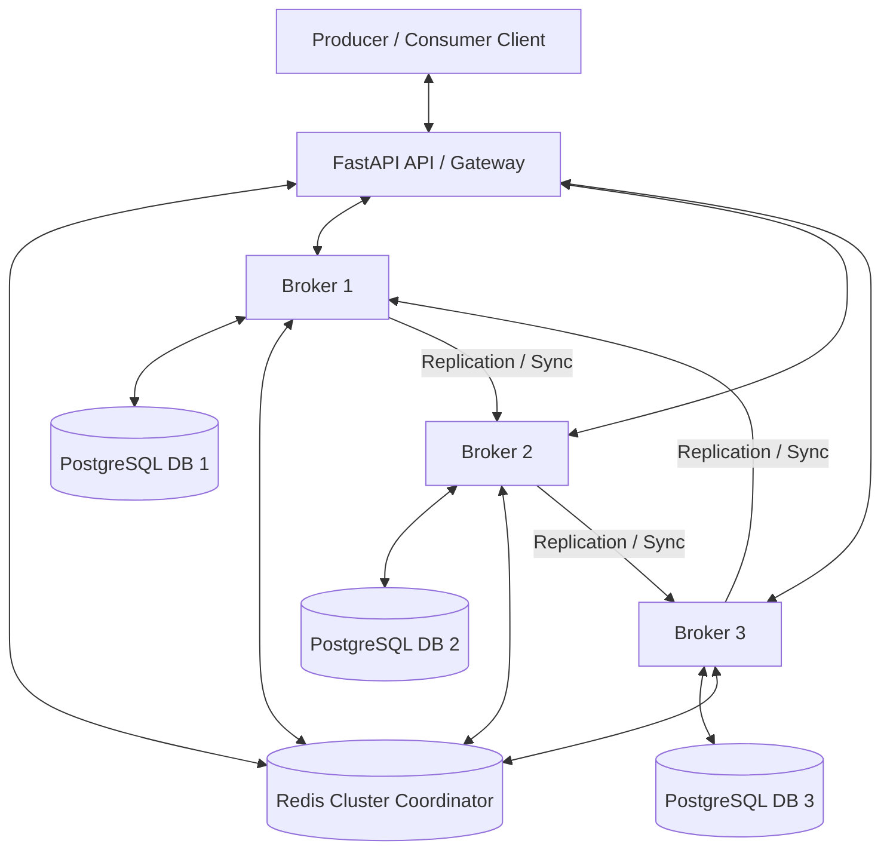

# KafkaX - Distributed Event Streaming Platform

KafkaX is a lightweight, educational, distributed event streaming platform built with Python (FastAPI), PostgreSQL, and Redis. It implements partition replication, configurable producer acknowledgments, broker failure detection & leader election, replica recovery, and consumer group coordination.

---

## Architecture Overview



---

## Technology Stack

- **Application Core**: Python 3.13, FastAPI (ASGI web framework)
- **Database / Storage**: PostgreSQL 16 (Durable commit logs, partitioned storage)
- **Caching & Coordination**: Redis 7 (Broker heartbeats, consumer group coordination, partition metadata, cluster metrics)
- **ORM / Database Driver**: SQLAlchemy 2.0 (Asyncio), asyncpg (Postgres), aiosqlite (Unit tests)
- **Testing**: pytest & pytest-asyncio

---

## Core Concepts & Design

### 1. Topic and Partition Design
- A **Topic** is a logical stream of events.
- Topics are split into one or more **Partitions** to scale throughput and provide fault tolerance.
- Each partition has an ordered sequence of events. Each event gets a unique, sequential ID called an **Offset**.
- Partitions are distributed round-robin across active brokers. For each partition, one broker is selected as the **Leader**, and other brokers are **Followers** (replicas).

### 2. Producer Write Flow & Acknowledgments (`acks`)
Producers publish events by specifying a topic and optional partition key. Write requests are routed to the partition leader. The leader commits the event to its database and handles replication based on the `acks` configuration:
- `acks=none`: Fire-and-forget. The leader schedules the write and replication in the background and returns a response immediately with `offset=-1`.
- `acks=leader`: The leader writes the event locally, returns the offset immediately, and schedules replication in the background.
- `acks=all`: The leader writes locally, sends replication requests to all in-sync replicas (ISR) in parallel, and waits for confirmation before returning the offset.

### 3. Replication & In-Sync Replicas (ISR)
- Each write to a partition leader is replicated to follower brokers.
- Followers handle replication by writing the event to their local database with the exact offset assigned by the leader, keeping their state consistent.
- **ISR (In-Sync Replicas)** tracks which replicas are actively caught up with the leader. If a replica fails to acknowledge a write, it is removed from the ISR in Redis to prevent system hang.

### 4. Failure Handling & Leader Election
- Active brokers send periodic heartbeats to Redis. If a broker's heartbeat expires (10 seconds), the cluster monitor detects the failure.
- For all partitions where the failed broker was the leader, a **Leader Election** is triggered:
  1. The failed broker is removed from the ISR.
  2. A new leader is elected from the remaining active members of the ISR.
  3. If no ISR members are active, a fallback leader is chosen from active replicas or active brokers.
  4. The partition metadata is updated in Redis, and consumer assignments are cleared to trigger a rebalance.

### 5. Replica Recovery
- When a failed broker restarts, it runs a background recovery process.
- It scans Redis metadata to find partitions it is a replica for but not currently in the ISR.
- It queries the leader's internal event-fetching API starting from its local `next_offset` to sync missing events.
- Once it is fully caught up to the leader's offset, it adds itself back to the ISR in Redis.

### 6. Consumer Groups & Offset Management
- Consumers join a group by sending heartbeats. Heartbeats are saved in Redis with a TTL of 10 seconds.
- Partitions of subscribed topics are distributed deterministically among active group members.
- If members join or leave, a **Consumer Rebalance** is triggered.
- Consumers commit offsets to Redis (`kafkax:group:{group}:offset:{topic}:{partition}`) and locally to the database. Resuming consumers query Redis to retrieve their last committed offset.

---

## REST API Examples

### 1. Create a Topic
```bash
POST http://localhost:8000/api/v1/topics/
Content-Type: application/json

{
  "name": "payments",
  "partition_count": 3
}
```

### 2. Publish an Event
```bash
POST http://localhost:8000/api/v1/topics/payments/publish
Content-Type: application/json
X-Producer-ID: prod-001

{
  "key": "user_123",
  "value": {
    "amount": 250.50,
    "currency": "USD"
  },
  "acks": "all"
}
```

### 3. Poll Events (Consumer)
```bash
GET http://localhost:8000/api/v1/topics/payments/events?partition=0&strategy=committed&group_id=billing-group&limit=10
```

### 4. Commit Consumer Offset
```bash
POST http://localhost:8000/api/v1/consumers/billing-group/offsets/commit
Content-Type: application/json

{
  "topic": "payments",
  "partition": 0,
  "offset": 5
}
```

### 5. Get Consumer Group Lag
```bash
GET http://localhost:8000/api/v1/consumer-groups/billing-group/lag
```
**Response:**
```json
{
  "group_id": "billing-group",
  "lag_details": [
    {
      "topic": "payments",
      "partition": 0,
      "latest_offset": 8,
      "committed_offset": 5,
      "lag": 3
    }
  ],
  "total_lag": 3
}
```

### 6. Metrics Endpoint
```bash
GET http://localhost:8000/api/v1/metrics
```
**Response:**
```json
{
  "events_published": 1500,
  "events_consumed": 1490,
  "avg_publish_latency_ms": 12.35,
  "avg_consume_latency_ms": 3.45,
  "consumer_lag": 10,
  "active_brokers": 3,
  "active_consumers": 2,
  "partition_count": 3,
  "replication_status": {
    "under_replicated_partitions": 0,
    "out_of_sync_replicas_count": 0,
    "status": "healthy"
  }
}
```

---

## Docker Setup

To start the full cluster (FastAPI Gateway, 3 isolated Brokers, PostgreSQL, and Redis):

1. **Start the containers:**
   ```bash
   docker-compose up --build -d
   ```
2. **Access API Documentation:**
   Open [http://localhost:8000/docs](http://localhost:8000/docs) in your browser.

3. **Verify running containers:**
   - Gateway API: `localhost:8000`
   - Broker 1: `localhost:8001`
   - Broker 2: `localhost:8002`
   - Broker 3: `localhost:8003`

---

## Running Tests

We run unit and integration tests using file-based SQLite databases to simulate database isolation for each broker:

```bash
python -m pytest
```

To run a specific test:
```bash
python -m pytest tests/test_replication_recovery.py -v
```

---

## Known Limitations

- **Educational Context**: Designed for learning purposes. It does not provide full binary protocols or disk-based segment files like Apache Kafka.
- **SQLite vs. PostgreSQL in Tests**: Unit tests run against isolated SQLite files to run quickly without external dependencies. PostgreSQL is utilized for production/docker environments.
- **Unclean Leader Election**: If all ISR members are dead, it falls back to choosing *any* active replica, which might result in data truncation/offset mismatches if that replica was offline during prior writes.
